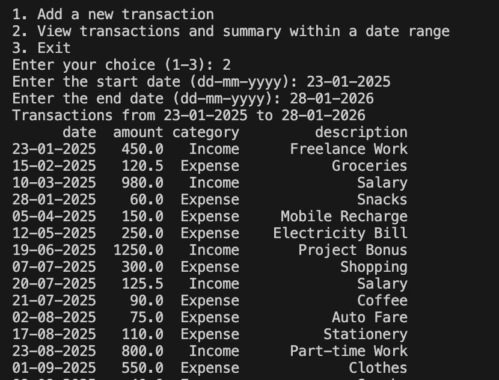

# Personal Finance Tracker (Python CLI App)

A lightweight Python command-line tool to track income, expenses, and visualize financial activity. Data is stored in a CSV file and analyzed using Pandas and Matplotlib.

---

## Features

- Add transactions (date, amount, category, description)
- View transactions within a date range
- Auto-calculated summary: income, expense, net savings
- Plot daily income and expenses
- CSV-based storage for simplicity

---

## Project Structure
├── main.py
├── data_entry.py
├── finance_data.csv
├── images/
│ ├── img1.png # Terminal output
│ └── img2.png # Graph
└── README.md

---

## Screenshots

**Terminal Output**  

**Income vs Expense Plot**  

---

## Requirements

Python 3.8+ recommended.

---

## Run the App

---

## Future Scope

- Category-wise analytics  
- Monthly reports  
- GUI version  

